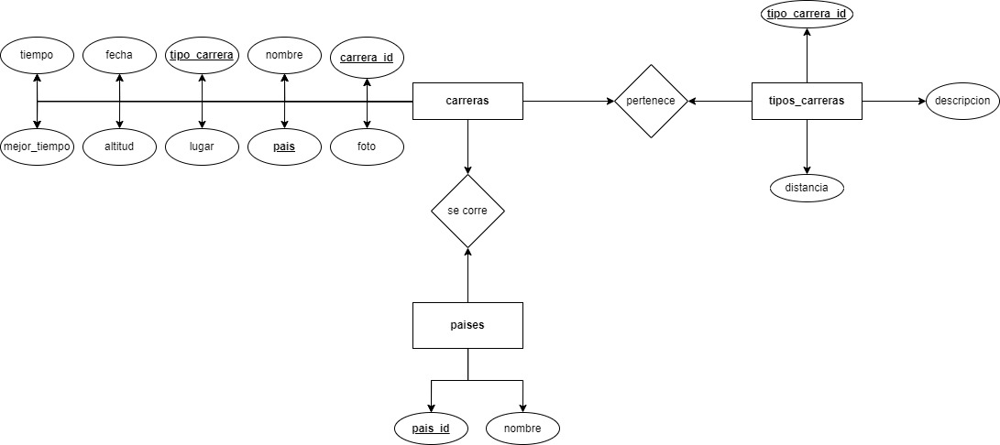
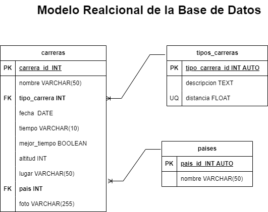

# Maratones

## Listado de entidades

### carreras **(ED)**

- carrera_id **(PK)**
- nombre
- tipo_carrera **(FK)**
- fecha
- tiempo
- mejor_tiempo
- altitud
- lugar
- pais **(FK)**
- foto

### tipos_carreras **(EC)**

- tipo_carrera_id **(PK)**
- descripcion
- distancia

### paises **(EC)**

-pais_id **(PK)**
-nombre

## Relaciones

1. Una **carrera** _pertence_ a un **tipo de carrera**. (_1 a M_)
1. Una **carrera** se _corre_ en un **país**. (_1 a M_)

## Diagrmas

### Modelo Entidad - Relación

### Modelo Relacional de la BD

## Reglas de Negocio

### carreras

1. Crear el registro de una carrera.
1. Leer el registro de una(s) carrera(s) dada una condición en particular.
1. Leer todos los registros de la entidad carreras.
1. Actualizar los datos de una carrera dada una condición en particular.
1. Eliminar los datos de una carrera dada una condición en particular.
   
### tipos_carreras

1. Crear el registro de un tipo de carrera.
1. Leer el registro de un(os) tipo(s) de carrera(s) dada una condición en particular.
1. Leer todos los registros de la entidad tipos carreras.
1. Actualizar los datos de un tipo de carrera dada una condición en particular.
1. Eliminar los datos de un tipo de carrera dada una condición en particular.

### paises

1. Crear el regisstro de un país.
2. Leer el registro de un(os) país(es) dada una condición en particular.
3. Leer todos los registros de la entidad paises.
4. Actualizar los datos de un país dada una condición en particular.
5. Eliminar los datos de un país dada una condición en particular.
